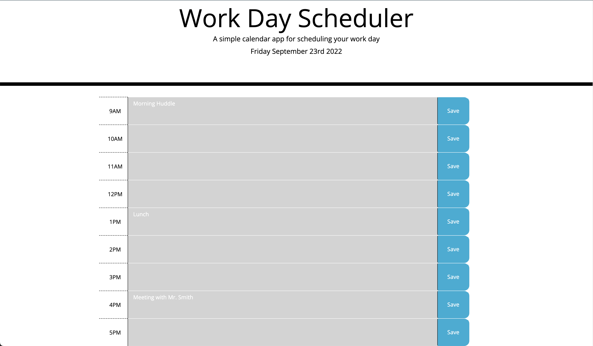

# 05-Third-Party-APIs-Challenge

Deployed URL: https://paksin.github.io/05-Third-Party-APIs-Challenge/

This challenge is to create a simple calendar application that allows a user to save events for each hour of the day by modifying starter code. This app will run in the browser and feature dynamically updated HTML and CSS powered by jQuery. Also,the Moment.js library is used to work with date and time.

